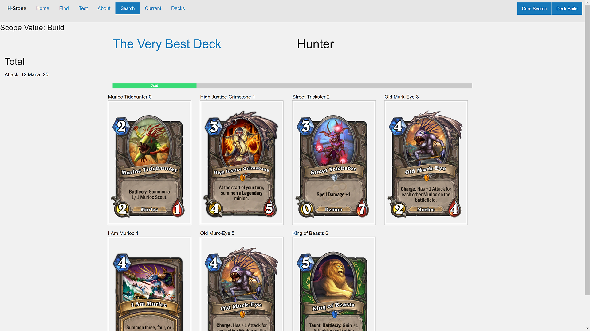

# HStone

Hearthstone web-app for the community
Built on Node.js, uses AngularJS.

## API
[hearthstone API](http://hearthstoneapi.com/)

# Layout
* Search for cards (name, class, type, cost)
* Active Deck
* Saved Decks

---

# Parameters
## Search Type
* Name
* Class
* Set
* Type

## Card Sets
* Basic
* Classic
* Promo
* Reward
* Naxxramas
* Goblin vs Gnomes
* Blackrock Mountain
* The Grand Tournament
* The League of Explorers
* Whispers of the Old Gods
* Karazhan
* Mean Streets of Gadgetzan
* Tavern Brawl
* Missions
* Credits
* Debug

## Card Types
* Minion
* Spell
* Weapon

## Player Classes
* Druid
* Hunter
* Mage
* Paladin
* Priest
* Rogue
* Shaman
* Warlock
* Warrior

### Search Outline

#### Name
Name

#### Class
Class -> cost -> attack -> health -> durability

#### Type
Type -> cost -> attack -> health -> durability

#### Set
Set -> cost -> attack -> health -> durability

## Deck Builder
* Card Limit (card.count <= 30)
* Card Class check (card.class == player.class)

